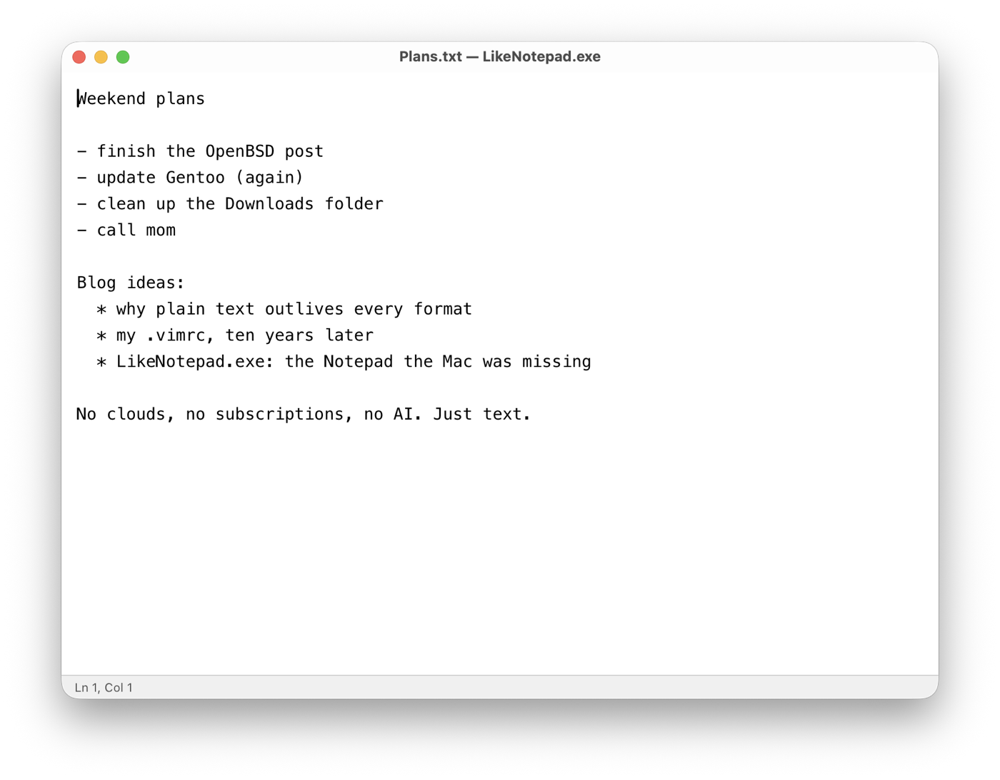
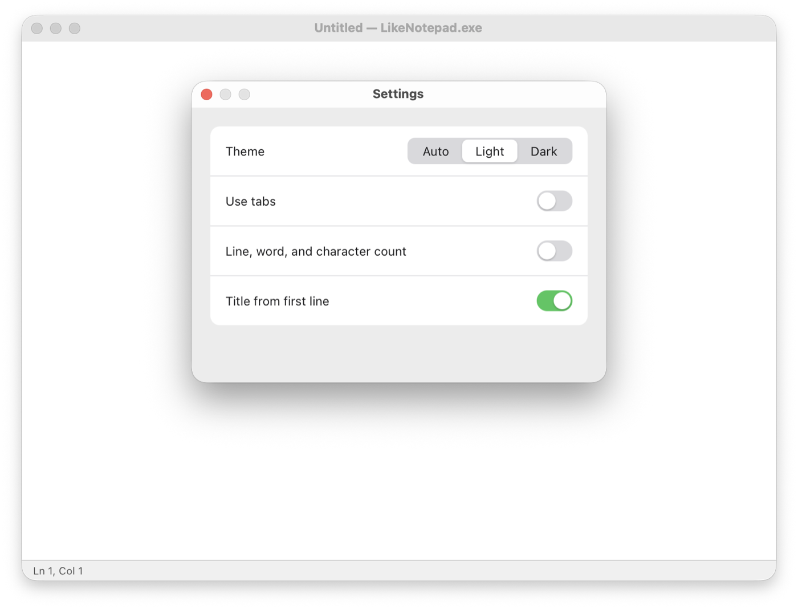
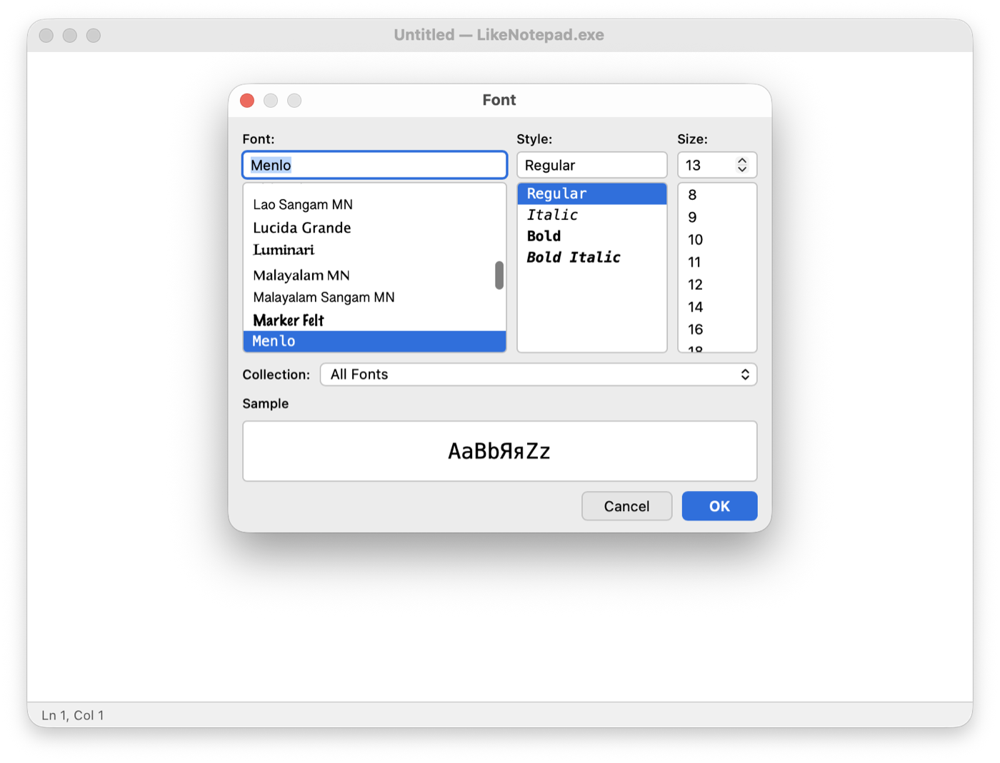

# LikeNotepad.exe

The same Notepad, but without Windows. No clouds, no subscriptions, no AI. Just text.

A small plain-text editor for macOS in the spirit of Windows Notepad, built with
[Tauri 2](https://tauri.app/): a native Rust shell (menus, alerts, file dialogs,
printing via AppKit) around a single `<textarea>` in WKWebView.



## Install

**Download:** grab `LikeNotepad.exe_<version>_universal.dmg` from the
[latest release](https://github.com/polatov/likenotepad/releases/latest), open it and drag
LikeNotepad.exe to Applications. One universal build runs on Apple Silicon and Intel Macs.

**Homebrew:**

```sh
brew install --cask polatov/tap/likenotepad
```

**First launch.** The app is not signed with an Apple Developer ID yet, so macOS refuses
to open it the first time and says it cannot check it for malicious software. Click
**Done**, then open System Settings → Privacy & Security, scroll down to the message
about LikeNotepad.exe and click **Open Anyway**. This is needed once.

Developed and tested on macOS 27; built for macOS 10.15 and later.

## Features

- New / Open / Open Recent / Save / Save As, multiple windows, optional native tabs
- Unsaved-changes alerts on close (⌘W) and quit (⌘Q), TextEdit style
- Find (⌘F) with match counter and case toggle, Find Next/Previous (⌘G / ⇧⌘G), Replace / Replace All
- Go to line, Time/Date insertion, the classic `.LOG` easter egg
- Word Wrap, font picker, light/dark/auto theme, status bar with line/column and counters
- Drag-to-select autoscroll on both axes
- Drop files onto a window to open them; the title bar shows the file's proxy icon
- The title bar follows the app's light/dark theme
- Page Setup and Print
- Saves each file back in the encoding (UTF-8, UTF-16, Windows-1251) and with the line endings (LF, CRLF, CR) it was opened with, like Notepad
- Registers as an editor for `txt`, `log`, `md`, `csv`, `json`, `xml`, `ini`, `conf`, `cfg`, `yaml`
- On first launch, asks macOS once to make it the default app for `.txt` (the system shows its own confirmation)
- UI in 8 languages: English, Russian, Spanish, German, French, Portuguese (Brazil),
  Chinese (Simplified), Japanese — picked from the system language

<p>
  
  
</p>

## Building

Requirements: macOS, [Rust](https://rustup.rs/) (stable), Node.js with npm.
On Apple Silicon, Node must be the arm64 build.

```sh
npm install
npm run dev      # run in development mode
npm run build    # build LikeNotepad.exe.app and a .dmg into src-tauri/target/release/bundle/
```

The frontend in `src/` is plain HTML/JS with no build step, so the app can also be
run without Node: `cd src-tauri && cargo run`.

## Tests

`tests/ui/run.sh` runs end-to-end UI checks of the selection highlight and
drag-autoscroll against the real app; see [tests/ui/README.md](tests/ui/README.md).

## Project layout

| Path | What it is |
|---|---|
| `src/index.html`, `src/app.js` | Editor window: textarea, find/replace, go to line, autoscroll, context menu |
| `src/settings.html`, `src/font-panel.html` | Settings and font windows |
| `src/i18n.js` | UI strings for the web side |
| `src-tauri/src/lib.rs` | Native side: menus, windows and tabs, file I/O, alerts, printing |
| `src-tauri/src/i18n.rs` | Strings for native menus and alerts (mirrors `src/i18n.js`) |
| `src-tauri/src/config.rs` | Persistent settings |
| `src-tauri/src/textfile.rs` | Reading and writing files in their own encoding and line endings |
| `tests/ui/` | End-to-end UI tests |
| `technical-lessons.md` | Notes on WebKit quirks found while building this |

## License

[MIT](LICENSE) © Timur Polatov
